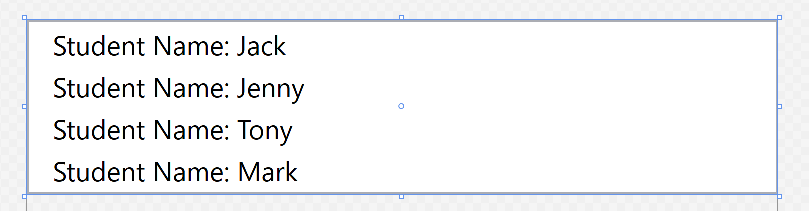

# WPF中Binding的StringFormat一些细节

在为控件绑定属性时，有时候需要进行一些简单的格式变换，而不是另建 `IValueConverter` 将问题复杂化，比如有下述模板类

```CSharp
class Student
{
    public string Name { get; set; }

    public int ID { get; set; }
}
```

为了达到的下面的排版效果


前台代码可以采用这种方式

``` xml
<ListBox ItemsSource="{Binding Students}" FontSize="18">
    <ListBox.ItemTemplate>
        <DataTemplate>
            <StackPanel Orientation="Horizontal">
                <TextBlock Text="Student Name: "/>
                <TextBlock Text="{Binding Name}" Margin="10 0"/>
            </StackPanel>
        </DataTemplate>
    </ListBox.ItemTemplate>
</ListBox>
```

然而这种方式存在问题在于使用了多余的控件，为了使代码更加精简，对于当前的应用场景——需要为前台控件绑定属性用于显示，然而为了显示更加清晰需要添加额外的说明性文字或固定的格式。

这时候与后台使用 `ToString()` 类似，前台的 `Binding` 也有对应的使用方法。

实际上 `Binding` 语法就是对应一个 `Binding : BindingBase` 的对象，而该对象具有很多属性用于绑定时的操作，比较常见的有：

`UpdateSourceTrigger` : 用于确定前台属性变化的通知方式，是一个枚举，比如 `LostFocus` 表示当控件失去焦点后前台的绑定属性变化； `PropertyChanged` 表示控件的绑定属性根据输入实时变化。

`Converter` : 用于类型转换，比如为 `Button.Visibility` 绑定后台的 `Boolean` 属性时，需要使用 `BooleanToVisibilityConverter` 才能将后台的 `Boolean` 属性转化为对应的 `Visibility` 枚举

而 `StringFormat` 则是格式化显示时候常用的属性，常用于数字的小数点显示，绑定内容的前缀后缀的添加以及时间的格式化形式。

对于上述的示例排版效果，可以通过下述前台代码实现

``` xml
<ListBox ItemsSource="{Binding Students}" FontSize="18">
    <ListBox.ItemTemplate>
        <DataTemplate>
            <TextBlock Text="{Binding Name,StringFormat=Student Name: {0}}" Margin="10 0"/>
        </DataTemplate>
    </ListBox.ItemTemplate>
</ListBox>
```

该前台代码与之前的效果完全相同，分析这里的绑定语句

```xml
Text="{Binding Name,StringFormat=Student Name: {0}}"
```

`Binding Name` 指定了绑定的属性名， `StringFormat=` 指定了格式化的方式，对于 `Binding` 单一属性而言，一般采用 `{0}` 表示绑定的属性内容，由于这里绑定的后台属性是 `string` 类型，没有太多变化的内容，下面用数字来说明格式化的多种形式。

假如后台 `ViewModel` 中具有属性 `Number`，在设计模式下给定初始值 `12345`, 前台的各类绑定代码及对应的显示效果如下

code

```xml
<StackPanel>
    <TextBlock Text="{Binding Number,
    StringFormat={}{0:C}}"/>
    <TextBlock Text="{Binding Number,
    StringFormat=Number: {0}}"/>
    <TextBlock Text="{Binding Number,
    StringFormat=Seconds: {0} (s)}"/>
    <TextBlock Text="{Binding Number,
    StringFormat={}{0:F2} km}"/>
    <TextBlock Text="{Binding Number,
    StringFormat={}{0:N2} km}"/>
    <TextBlock Text="{Binding Number,
    StringFormat={}{0:G4} km}"/>
    <TextBlock Text="{Binding Number,
    StringFormat={}{0:E4} km}"/>
    <TextBlock Text="{Binding Number,
    StringFormat={}{0:P3} Percentage}"/>
    <TextBlock Text="{Binding Number,
    StringFormat='Seconds: {0:F2} s'}"/>
</StackPanel>
```

result


为了使用 `{0:x}` 类似的格式化模式，必须保证有前缀或者 `{}` 表示空前缀，例如第一个 `{}{0:C}` 表示了一个空前缀按照货币显示格式化数字，第二个 `Number: {0}` 使用 `Number:` 作为前缀 `{0}` 则代表格式化的属性。下面便是一些 `ToString()` 中常用的格式化标识，包括 `F2` 保留2位小数，`N2` 保留2位小数并使用逗号分隔千分位，`G4` 保留4个有效数字，`E4` 使用科学计数法并保留4位小数位，`P3` 使用百分数表示法并保留3位小数。

上述代码的最后一个中， `StringFormat` 也可以为其赋值字符串达到同等的效果，不过看上去像是多此一举
