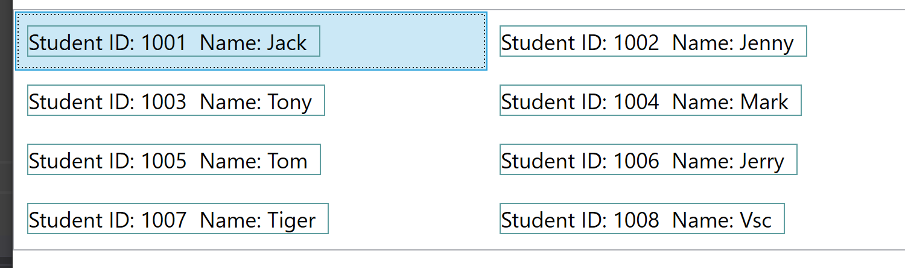

# 自定义 `ListBox` 的控件面板

在默认情况下，`ListBox` 的子项目显示类似于默认的 `StackPanel`，在水平方向为 `Strench` 垂直方向进行堆叠.

而有时候，为了控制子元素的布局方式，需要自定义 `ListBox` 的内部面板，例如为了实现下面的效果



可以看到，上面采用的是双列布局，实际上用的是 `UniformGrid` 控件作为 `ListBox` 的内部面板，因此，对于绑定的数据集合，就相当于是在一个 `UniformGrid` 中进行放置，唯一区别的是，每个子元素的范围是其实际的占用区域，在其外部还有许多留白，这部分相当于是 `ListBox` 的子区域点击外侧的空白处也是可以触发 `SelectedValueChanged`

相关的 `XAML` 代码如下

```xml
<ListBox ItemsSource="{Binding Students}">
    <!--此处ItemsPanel即设置ListBox内部面板 -->
    <ListBox.ItemsPanel>
        <ItemsPanelTemplate>
            <UniformGrid Columns="2"/>
        </ItemsPanelTemplate>
    </ListBox.ItemsPanel>
    <ListBox.ItemTemplate>
        <DataTemplate>
            <Border BorderBrush="CadetBlue" BorderThickness="1" Margin="5">
                <StackPanel Orientation="Horizontal">
                    <TextBlock Text="{Binding ID,StringFormat=Student ID: {0}}" FontSize="18"/>
                    <TextBlock Text="{Binding Name,StringFormat=Name: {0}}" FontSize="18" Margin="10 0"/>
                </StackPanel>
            </Border>
        </DataTemplate>
    </ListBox.ItemTemplate>
</ListBox>
```

>对于 `ItemsControl` 的进一步布局、数据绑定知识，可以参考微软官方文档 [Data Templating Overview](https://docs.microsoft.com/en-us/dotnet/framework/wpf/data/data-templating-overview), 在该文档中可以查阅到 `ItemsControl` 对于数据模板 `DataTemplate`，控件模板 `ControlTemplate` 和项目面板 `ItemsPanel` 的详细说明
