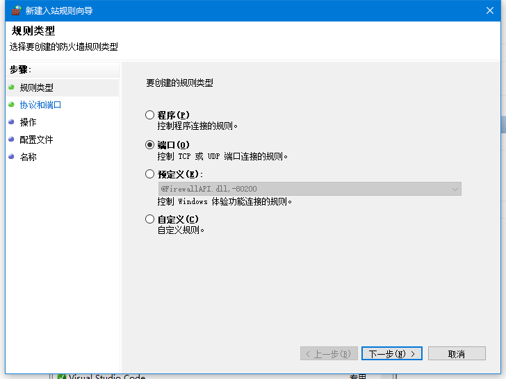
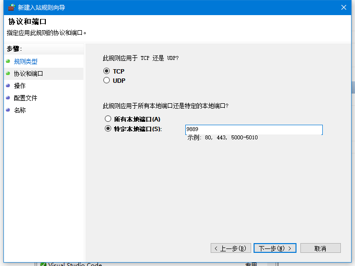
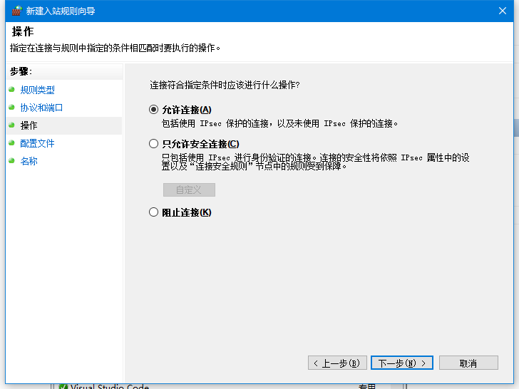
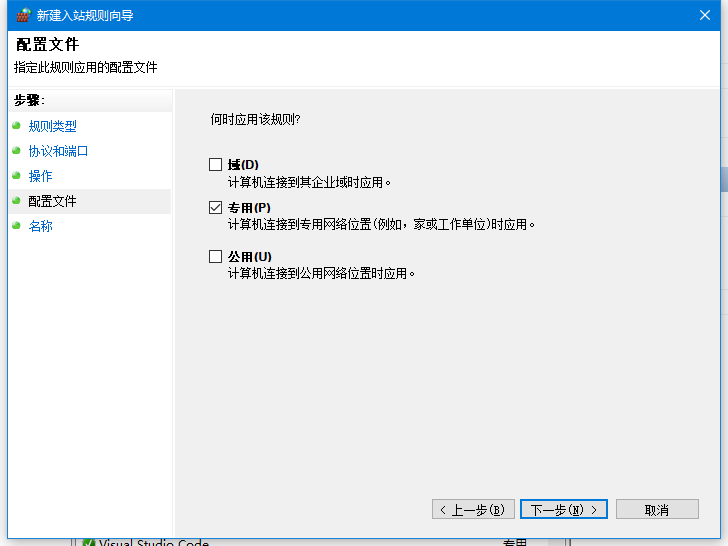
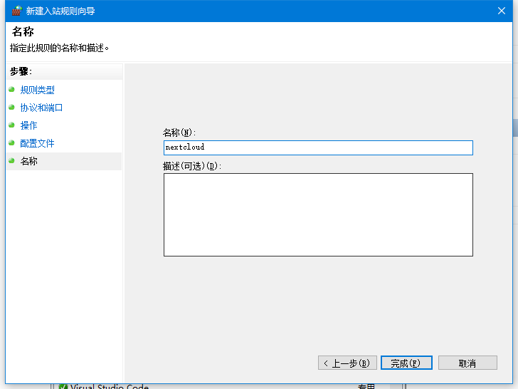

# NextCloud 在 Win 端的网络访问配置

## 1. WSL2 的 IP 配置问题

在 Windows 每次重启后, WSL2 的 IP 将会发生变化, 即 WSL2 的 IP 并非静态地址. 为此, 通过下述代码可以手动为 WSL2 增加一个 IP 地址.

```sh
::强制获取管理员运行权限
%1 mshta vbscript:CreateObject("Shell.Application").ShellExecute("cmd.exe","/c %~s0 ::","","runas",1)(window.close)&&exit
wsl -d Ubuntu -u root ip addr add 192.168.50.16/24 broadcast 192.168.50.255 dev eth0 label eth0:1
netsh interface ip add address "vEthernet (WSL)" 192.168.50.88 255.255.255.0
```

上述命令的作用为: 以管理员身份启动 cmd(netsh命令执行的前提), 为 Linux 分发版 Ubuntu 添加一个 IP 地址 192.168.50.16/24, 可在 WSL 中使用 `ifconfig` 命令查看结果, 其中 Ubuntu 为 Linux分发版名(可以通过 `wsl --list --verbose` 查看详细的分发名),  然后为本地 vEthernet(WSL) 添加一个 IP 地址.

上述命令执行完毕后, 便可在 Windows 端访问 192.168.50.16 从而访问 WSL, 因为 apache2 服务部署在 WSL 的80端口, 因此在 Windows 段访问 192.168.50.16 即为访问 NextCloud.

## 2. NextCloud 的访问配置

默认情况下, NextCloud 不允许通过 IP 地址访问, 需要添加 IP 白名单才能通过 IP访问. 打开 /var/www/nextcloud/config/config.php 文件, 可以找到文件中名为 'trusted_domains', 按照相同格式添加 IP 即可完成 NextCloud 的 IP 地址访问配置.

```sh
'trusted_domains' =>
array (
    0 => 'localhost',
    1 => '192.168.3.3',
)
```

上面添加了 IP 地址 192.168.3.3, 该 IP 为 Windows 端的本地 IP, 在网络配置都完成后, 便可在当前局域网中通过访问 192.168.3.3:端口号 来访问 NextCloud.

由于上面访问的是 apache2 的主页, 因此需要更改一下 apache2 的 DocumentRoot, 打开 /etc/apache2/sites-available/000-default.conf 文件, 找到 DocumentRoot, 将默认的 /var/www/html 改为 /var/www/nextcloud

```sh
sudo vim /etc/apache2/sites-available/000-default.conf
# 000-default.conf
...
DocumentRoot /var/www/nextcloud
...
```

## 3. Windows 端的端口转发配置

上述步骤完成后, 便可在 Windows 端访问 192.168.50.16:端口号 从而访问 NextCloud, 通过添加端口转发, 最终达成访问 本地IP:端口号 从而访问 NextCloud 的目的.

```sh
# 以管理员方式启动的 PowerShell 或 cmd
netsh interface portproxy add v4tov4 listenport=9889 listenaddress=0.0.0.0 connectport=80 connectaddress=192.168.50.16
```

执行命令 `netsh interface portproxy show all` 查看上述配置是否完成.

## 4. 局域网防火墙配置

由于 Win10 默认开启三域防火墙, 局域网中的主机是无法成功访问 NextCloud, 若直接关闭防火墙可能会引发不必要的后果, 因此在防火墙的出入站规则中, 将 9889 端口开放即可.

打开 Windows安全中心, 转到防火墙和网络保护, 可以看到当前三域的防火墙都是开启状态, 点击高级设置进入高级安全 Windows Defender 防火墙, 左侧有入站规则和出站规则, 分别添加相关规则.

主要步骤(出入站均相同):

新建规则, 选择端口后下一步



选择 TCP, 输入特定端口号 9889



选择允许连接



根据当前网络所属域选择何时应用规则



输入名称



## 4. 测试并配置开机启动

通过 Windows 端访问 192.168.3.3:9889 能够正常访问 NextCloud 的登陆界面.

为了让 Windows 开机后便启动所有服务, 编写脚本开启启动 WSL2 和设置 IP 地址.

`Win + R` 打开 shell:startup, 创建脚本文件 wsl-auto-startup.bat, 内容如下

```sh
::开机启动wsl中的脚本, 脚本中启动 WSL 中的服务
powershell.exe -WindowStyle Hidden -c "bash /init.sh "

::强制获取管理员运行权限后添加 IP 地址
%1 mshta vbscript:CreateObject("Shell.Application").ShellExecute("cmd.exe","/c %~s0 ::","","runas",1)(window.close)&&exit
wsl -d Ubuntu -u root ip addr add 192.168.50.16/24 broadcast 192.168.50.255 dev eth0 label eth0:1
netsh interface ip add address "vEthernet (WSL)" 192.168.50.88 255.255.255.0
```

在 WSL 中新建文件 /init.sh, 文件放在根目录下, 内容如下, 将 yourpassword 换成用户密码即可(WSL 启动时登录用户, 不一定为 root)

```sh
#!/bin/bash
echo "yourpassword" | sudo -S /usr/sbin/service mysql start
echo "yourpassword" | sudo -S /usr/sbin/service apache2 start
```

重启 Windows 测试上述配置是否生效, 至此, NextCloud 的局域网配置和开机自启全部完成.
